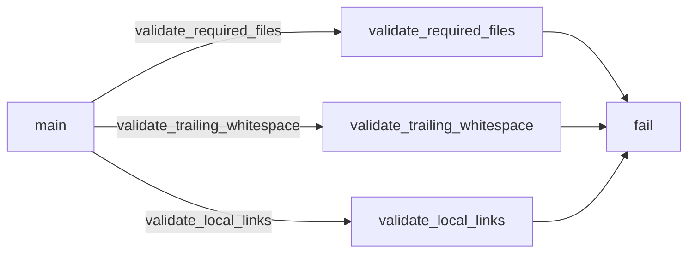

# Documentation

**Documentation Module**
========================

**Overview**
------------

The Documentation module is responsible for validating the integrity of documentation files within the project. It checks for required files, trailing whitespace, and local links in Markdown documents.

**Purpose**
----------

The purpose of this module is to ensure that all documentation files are accurate, complete, and properly formatted. This helps maintain a consistent and reliable source of information for developers and users alike.

**How it Works**
----------------

The Documentation module consists of several key components:

*   **Required Files Validation**: The `validate_required_files` function checks if all required documentation files (e.g., README.md, ROADMAP.md) exist in the correct locations.
*   **Trailing Whitespace Detection**: The `validate_trailing_whitespace` function verifies that Markdown documents do not contain trailing whitespace.
*   **Local Link Resolution**: The `validate_local_links` function ensures that local links in Markdown documents are properly resolved and point to existing files.

Here's a high-level overview of the execution flow:

1.  The `main` function is called when the script is executed.
2.  It validates required files using `validate_required_files`.
3.  If all required files exist, it sorts and filters Markdown files using `rglob` and `is_skipped`.
4.  It then calls `validate_trailing_whitespace` to check for trailing whitespace in Markdown documents.
5.  Finally, it calls `validate_local_links` to resolve local links.

**Key Components**
-----------------

*   **`ROOT`**: The root directory of the project, used as a reference point for file paths.
*   **`REQUIRED_FILES`**: A list of required documentation files that must exist in specific locations.
*   **`LOCAL_LINK_RE`**: A regular expression pattern to match local links in Markdown documents.

**Call Graph & Execution Flows**
------------------------------

The following Mermaid diagram illustrates the call graph and execution flows for this module:

**Connecting to the Rest of the Codebase**
-----------------------------------------

The Documentation module is designed to be integrated with other parts of the codebase. It can be run as a standalone script or incorporated into the build process.

To use this module, simply execute the `scripts/check_docs.py` script in your terminal. The script will automatically detect and validate documentation files based on the project's structure.

**Troubleshooting**
------------------

If you encounter any issues with the Documentation module, refer to the following common error messages:

*   "File di documentazione obbligatori mancanti" (Required documentation file missing)
*   "Whitespace finale trovato" (Trailing whitespace detected)
*   "Link Markdown locali rotti" (Local link in Markdown document is broken)

For more detailed information, please consult the code comments and error messages.