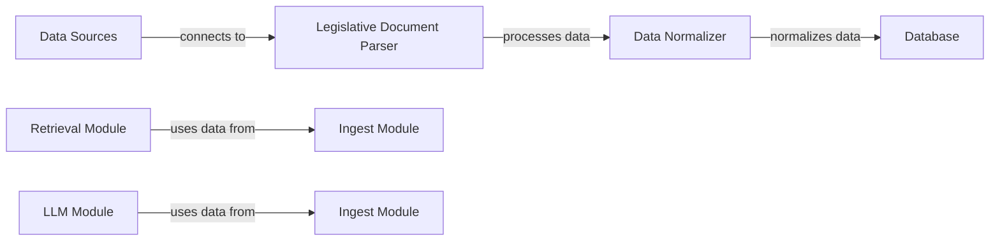

# Ingest

**Ingest Module Documentation**

**Overview**

The Ingest module is responsible for collecting and processing data from various sources, including legislative documents, court decisions, and other relevant information. Its primary purpose is to provide a centralized platform for ingesting and normalizing data, making it accessible for downstream applications.

**How it Works**

The Ingest module consists of several key components:

1. **Data Sources**: The module connects to various data sources, including legislative databases, court repositories, and other relevant information systems.
2. **Data Processing**: Once connected to the data source, the module processes the data using a combination of natural language processing (NLP) techniques and machine learning algorithms.
3. **Data Normalization**: The processed data is then normalized to ensure consistency and accuracy across different formats and structures.
4. **Data Storage**: The normalized data is stored in a centralized database, making it accessible for downstream applications.

**Key Components**

1. **Legislative Document Parser**: A custom-built parser that extracts relevant information from legislative documents, including text, metadata, and other relevant details.
2. **Court Decision Parser**: A parser that extracts relevant information from court decisions, including text, metadata, and other relevant details.
3. **Data Normalizer**: A module that normalizes the processed data to ensure consistency and accuracy across different formats and structures.
4. **Database**: A centralized database that stores the normalized data.

**Connections to Other Components**

The Ingest module connects to various components in the codebase, including:

1. **Retrieval Module**: The Ingest module provides data to the Retrieval module, which uses it for downstream applications such as search and ranking.
2. **LLM Module**: The Ingest module provides data to the LLM (Large Language Model) module, which uses it for tasks such as text generation and classification.
3. **Database Module**: The Ingest module stores data in a centralized database, making it accessible for downstream applications.

**Mermaid Diagram**

**API Documentation**

The Ingest module provides several APIs for interacting with the data, including:

1. **`getCorpusDimostrativo`**: Returns a corpus of legislative documents.
2. **`parseLegge241Esempio`**: Parses a legislative document and returns its metadata.
3. **`creaManifestoIngest`**: Creates a manifesto for ingesting data from a specific source.

**Troubleshooting**

Common issues with the Ingest module include:

1. **Data connectivity issues**: Ensure that all data sources are properly connected and configured.
2. **Data processing errors**: Check the logs for any errors during data processing and normalization.
3. **Database issues**: Ensure that the database is properly configured and running.

**Conclusion**

The Ingest module plays a critical role in the codebase, providing a centralized platform for ingesting and normalizing data. Its key components, including the Legislative Document Parser and Data Normalizer, work together to ensure high-quality data is available for downstream applications.