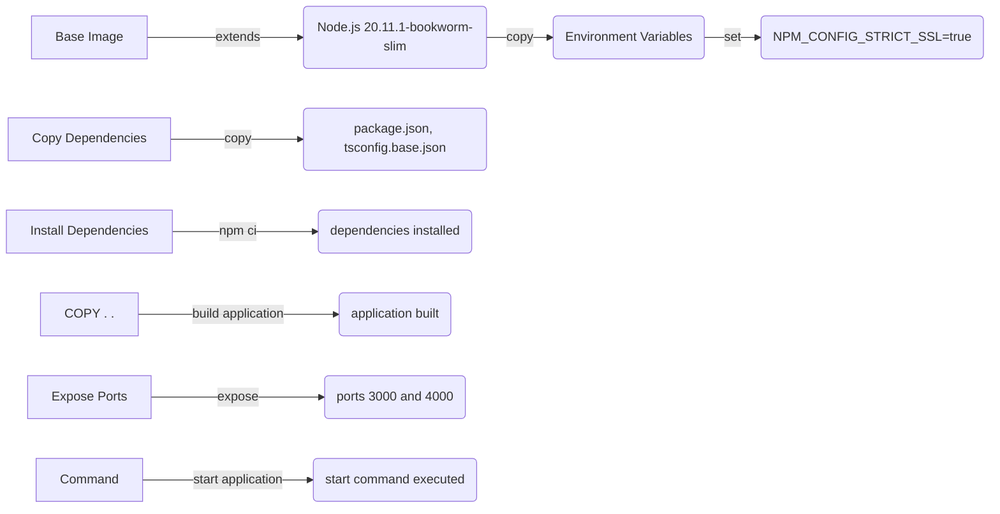

# Other — Dockerfile

**Other — Dockerfile**
=====================

## Overview

The `Dockerfile` is a crucial component in building and deploying the Italian Oss Legal Platform (IOLP) application. This module provides instructions for creating a Docker image that contains all the necessary dependencies and code for the platform.

## Purpose

The primary purpose of this module is to automate the process of building and deploying the IOLP application using Docker. By leveraging the `Dockerfile`, developers can ensure consistency across different environments, simplify deployment, and reduce the risk of errors.

## How it Works

Here's a step-by-step explanation of how the `Dockerfile` works:

1. **Base Image**: The `Dockerfile` starts by using the official Node.js 20.11.1-bookworm-slim image as the base.
2. **Environment Variables**: The module sets environment variables, including `NEXT_TELEMETRY_DISABLED=1`, to disable telemetry features in the application.
3. **Argument**: An argument is set for `NPM_CONFIG_STRICT_SSL` to ensure strict SSL configuration during npm operations.
4. **Copy Dependencies**: The module copies necessary package files (e.g., `package.json`, `tsconfig.base.json`) from various directories into the container.
5. **Install Dependencies**: The `RUN` command installs dependencies using `npm ci --include=dev --no-audit --no-fund`.
6. **Build Application**: The `COPY . .` instruction copies the application code into the container, and the `RUN npm run build` command builds the application.
7. **Expose Ports**: The module exposes ports 3000 and 4000 for external access.
8. **Command**: The final `CMD` instruction sets the default command to start the application using `npm`.

## Key Components

* **Base Image**: Official Node.js 20.11.1-bookworm-slim image
* **Environment Variables**: `NEXT_TELEMETRY_DISABLED=1`, `NPM_CONFIG_STRICT_SSL=true`
* **Dependencies**: Various packages (e.g., `@italian-oss-legal-platform/web`, `npm`)
* **Application Code**: Copied from various directories

## Connection to the Rest of the Codebase

The `Dockerfile` is closely tied to other modules in the codebase, particularly:

* **`package.json` and `tsconfig.base.json`**: These files contain dependencies and build configurations for the application.
* **`npm run build`**: This command builds the application using the specified configuration.

## Mermaid Diagram: Docker Image Layers

This Mermaid diagram illustrates the flow of instructions in the `Dockerfile`, from setting environment variables to building the application.