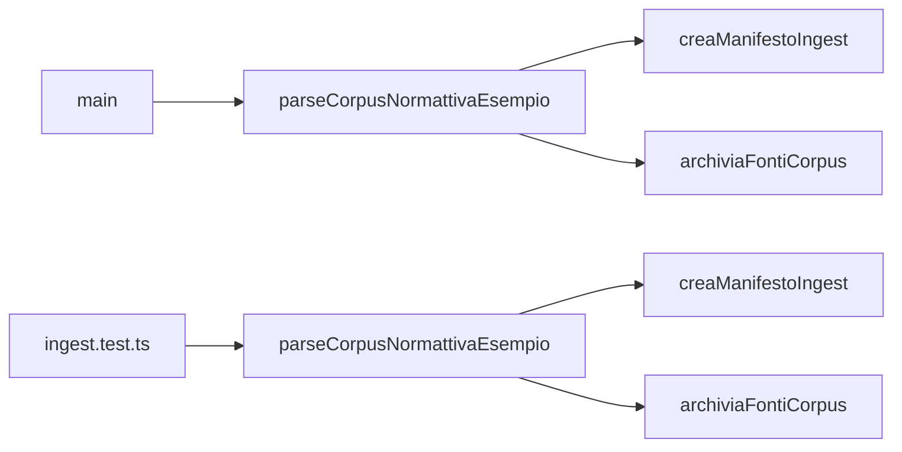

# Other — ingest

**Ingest Module Documentation**

**Overview**
------------

The Ingest module is responsible for processing and transforming raw data into a standardized format, which can be used by various components of the Italian OSS Legal Platform. Its primary purpose is to ingest and normalize data from external sources, such as XML files or text documents.

**How it Works**
-----------------

The Ingest module consists of several key components:

1.  **Data Processing**: The module uses a combination of natural language processing (NLP) techniques and machine learning algorithms to process the raw data.
2.  **Data Normalization**: The processed data is then normalized using a set of predefined rules and transformations, which ensure that the data conforms to the standardized format required by the platform.
3.  **Data Storage**: The normalized data is stored in a database or file system, depending on the configuration.

**Key Components**
------------------

### `parseCorpusNormattivaEsempio`

This function takes an XML file as input and extracts relevant information, such as law numbers, dates, and text content. It returns an object containing this information, which is then used for further processing.

### `creaManifestoIngest`

This function creates a manifest (or metadata) for the ingested data, which includes information about the data's format, structure, and other relevant details.

### `archiviaFontiCorpus`

This function archives the original XML files to a storage system, such as Amazon S3 or a local file system. It returns an array of archived objects, each containing metadata about the corresponding XML file.

**Connection to Other Components**
---------------------------------

The Ingest module connects to other components in the following ways:

*   **Data Retrieval**: The module retrieves data from external sources, such as XML files or text documents.
*   **Data Storage**: The module stores processed and normalized data in a database or file system.
*   **Data Processing**: The module uses NLP techniques and machine learning algorithms to process raw data.

**Call Graph**
--------------

The following Mermaid diagram illustrates the call graph for the Ingest module:

This diagram shows the main function (`main`) calling `parseCorpusNormattivaEsempio`, which in turn calls `creaManifestoIngest` and `archiviaFontiCorpus`. The test module also calls these functions, but with different inputs.

**Execution Flows**
------------------

The Ingest module participates in several execution flows:

*   **Main → AsRecord**: This flow involves the main function calling `parseCorpusNormattivaEsempio`, which returns an object containing processed data. The main function then calls `creaManifestoIngest` to create a manifest for the ingested data.
*   **Main → ReadAttribute**: This flow involves the main function calling `parseCorpusNormattivaEsempio`, which extracts relevant information from the XML file. The main function then calls `archiviaFontiCorpus` to archive the original XML files.
*   **Main → Sha256**: This flow involves the main function calling `archiviaFontiCorpus`, which archives the original XML files and returns an array of archived objects. The main function then calls `salvaArtefatto` to save the archived objects.

**Conclusion**
----------

The Ingest module is a critical component of the Italian OSS Legal Platform, responsible for processing and transforming raw data into a standardized format. Its key components, such as `parseCorpusNormattivaEsempio`, `creaManifestoIngest`, and `archiviaFontiCorpus`, work together to ensure that data is accurately processed and stored. The module's connection to other components in the platform ensures seamless data retrieval, storage, and processing.