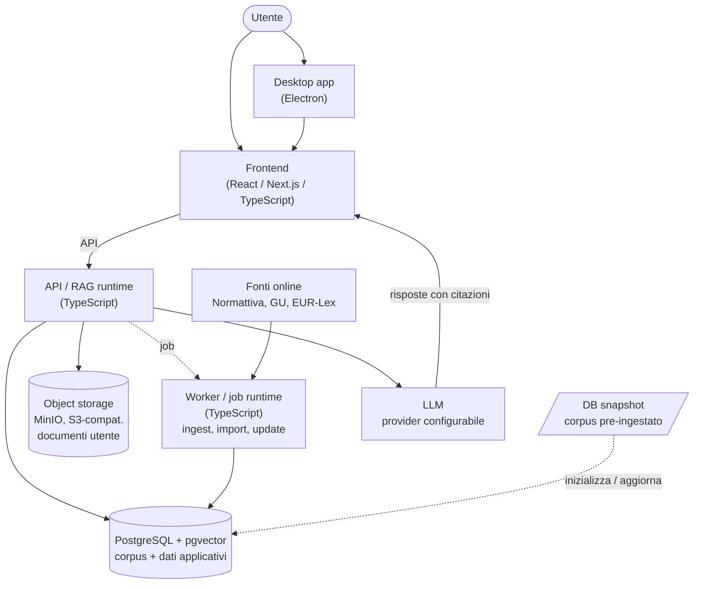

# Architettura

Bozza di architettura per Magistra. In questa fase serve a orientare le scelte; non è ancora un'implementazione. La direzione attuale è **TypeScript-first**, con processi separati per runtime realtime e job batch.

## Vista d'insieme

## Concetti

- [Frontend (Next.js)](/architettura/frontend.md)
- [Backend / API (TypeScript)](/architettura/backend-api.md)
- [Scelta stack e runtime](/architettura/scelta-stack-runtime.md)
- [Indice normativo + Vector DB](/architettura/indice-normativo.md)
- [Database applicativo](/architettura/database-applicativo.md)
- [Object storage (S3-compatibile)](/architettura/object-storage.md)
- [Provider LLM (configurabile)](/architettura/provider-llm.md)
- [Gestione delle API key](/architettura/gestione-api-key.md)
- [Conversione documenti](/architettura/conversione-documenti.md)
- [Pianificazione delle query](/architettura/pianificazione-query.md)
- [Flusso di una domanda (RAG agentico)](/architettura/flusso-rag.md)
- [Deployment e self-hosting](/architettura/deployment.md)

## Principi architetturali

- **Citazione prima di tutto**: nessuna risposta normativa senza fonte recuperata dall'indice.
- **TypeScript-first**: lo stack applicativo primario è TypeScript/JavaScript per favorire accessibilità OSS, condivisione di tipi e distribuzione desktop.
- **Single-utente**: questa versione OSS è pensata per una sola persona su un proprio computer/server; non gestisce account, login né multi-utenza (quelli sono previsti solo per la futura versione cloud gestita).
- **Runtime separati**: API/chat e job batch non condividono lo stesso processo; ingest, import e reindicizzazione vivono nel worker.
- **Corpus pre-ingestato**: l'utente finale riceve un database già popolato o aggiornabile; l'ingest completo del corpus è una responsabilità della pipeline di release.
- **Separazione dati/modello**: la qualità dipende dai dati e dal retrieval, non solo dall'LLM.
- **Self-hosting possibile**: l'architettura deve poter girare interamente sotto il controllo dell'utente.
- **Modularità**: provider LLM, storage e database intercambiabili.
