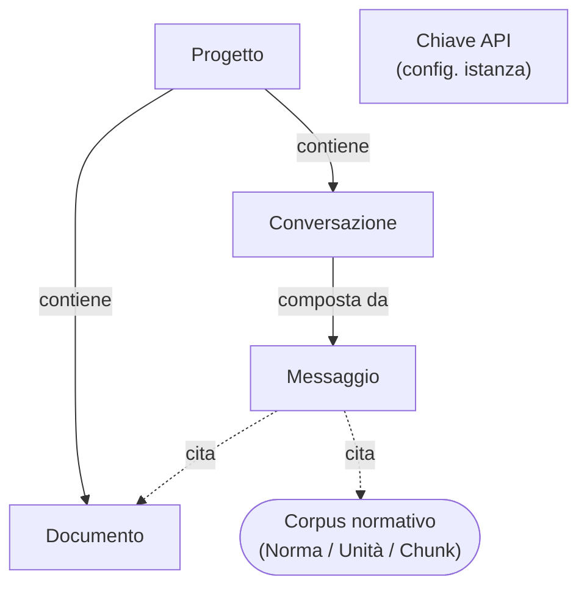

# Modello dati applicativo

Oltre al **corpus normativo** ([Norma](./norma.md), [Versione](./versione.md), [Unità](./unita.md), [Chunk](./chunk.md)), la piattaforma gestisce i **dati dell'applicazione**: il lavoro dell'utente sui documenti.

Queste entità vivono nel [database applicativo](../architettura/database-applicativo.md) e sono nettamente separate dal corpus pubblico.
Trattandosi di una versione **single-utente**, non esiste un'entità "utente" né alcun modello di account o condivisione.

## Entità

- [Progetto](./progetto.md)
- [Documento](./documento.md)
- [Conversazione](./conversazione.md)
- [Messaggio](./messaggio.md)
- [Chiave API](./chiave-api.md)

> Bozza concettuale: lo schema serve a ragionare sui dati del prodotto, non è ancora un'implementazione.
