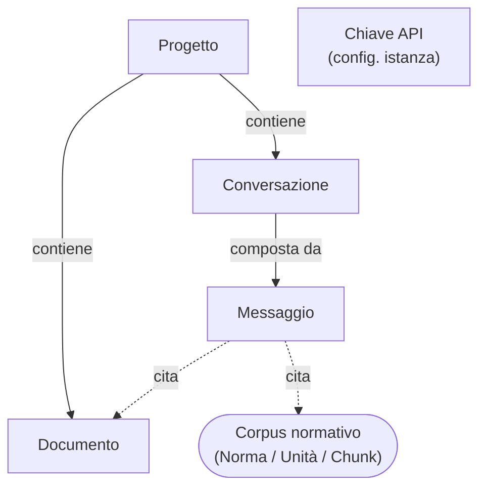

# Modello dati applicativo

Oltre al **corpus normativo** ([Norma](./norma.md), [Versione](./versione.md), [Unità](./unita.md), [Chunk](./chunk.md)), la piattaforma gestisce i **dati dell'applicazione**: il lavoro dell'utente sui documenti.

Queste entità vivono nel [database applicativo](../architettura/database-applicativo.md) e sono nettamente separate dal corpus pubblico.
Trattandosi di una versione **single-utente**, non esiste un'entità "utente" né alcun modello di account o condivisione.

```mermaid
flowchart TD
    P["Progetto"]
    D["Documento"]
    C["Conversazione"]
    M["Messaggio"]
    K["Chiave API<br/>(config. istanza)"]

    P -->|contiene| D
    P -->|contiene| C
    C -->|composta da| M
    M -. cita .-> D
    M -. cita .-> Corpus(["Corpus normativo<br/>(Norma / Unità / Chunk)"])
```

## Entità

- [Progetto](./progetto.md)
- [Documento](./documento.md)
- [Conversazione](./conversazione.md)
- [Messaggio](./messaggio.md)
- [Chiave API](./chiave-api.md)

## Schema logico

| Entità | Chiave primaria | Campi relazione | Cardinalità |
|---|---|---|---|
| Progetto | `id` | — | contiene 0..N Documenti e 0..N Conversazioni |
| Documento | `id` | `progetto_id` → Progetto.`id` | appartiene a 1 Progetto |
| Conversazione | `id` | `progetto_id` → Progetto.`id` opzionale | appartiene a 0..1 Progetto |
| Messaggio | `id` | `conversazione_id` → Conversazione.`id` | appartiene a 1 Conversazione |
| Chiave API | `id` | — | configurazione locale dell'istanza |

Il modello resta single-utente: non esistono tabelle `utente`, `organizzazione`, membership o permessi.

## Dati denormalizzati ammessi

Alcuni campi possono restare JSON o snapshot denormalizzati per tracciabilità:

- query generate e chunk usati in [Messaggio](./messaggio.md);
- metadati di citazione prodotti dal retrieval;
- cronologia versioni del [Documento](./documento.md), finché non serve una tabella dedicata.

Questi snapshot non sostituiscono le relazioni principali: servono a riprodurre come una risposta è stata costruita.
