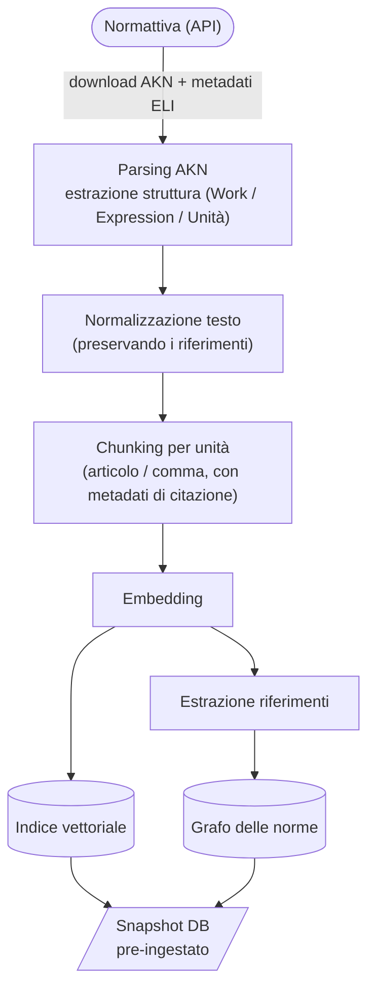

# Pipeline di trasformazione

**Principio chiave**: ogni [Chunk](/modello-dati/chunk.md) porta con sé i metadati necessari a costruire una **[citazione verificabile](/glossario/citazione-verificabile.md)** ([ELI](/glossario/eli.md) + articolo + comma + data di vigenza). Senza questi metadati il chunk non entra nell'indice.

Le fasi attingono dalla fonte [Normattiva](/fonti/normattiva.md) e alimentano l'[indice normativo](/architettura/indice-normativo.md).

## Responsabilità di release

L'ingest completo del corpus è una responsabilità dei maintainer e della pipeline di release, non un'operazione da ripetere su ogni dispositivo dell'utente finale. La release può produrre uno snapshot del database già indicizzato, verificabile e aggiornabile.

Nel runtime utente restano possibili import incrementali: se il database locale non contiene una fonte necessaria, il sistema la recupera online, la importa, rigenera i chunk/embedding necessari e poi usa quei dati per il sunto LLM con citazioni.
